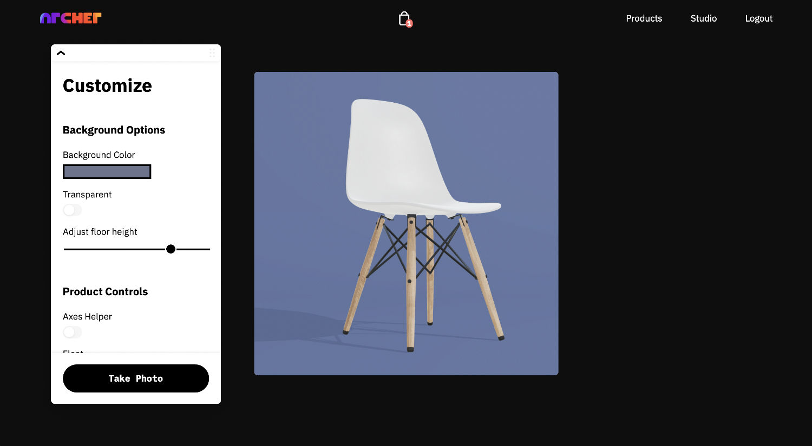

# Virtual photo studio :camera:

A CG based photo studio that runs in the browser. It enables brands to create photorealistic images from 3D models and artists to accept modelling jobs. It consists of three separate apps:

## Archer
Archer is the customer facing app and contains the virtual photo studio as well as an interface to order 3D models from snapshots of a product. 
[Live Demo](https://archer.fotura.co)

## Pro
A marketplace extension that allows CG artists to submit quotes for modelling jobs submitted through Archer. Jobs can be submitted through the Pro app and appear directly in customers inventories.

## Admin
A management panel to approve artists, and interact with pending jobs and quotes.

## FAQ

**Can I use the output files for my PoD store or social?**
 
Yes. Let me know if you do, I'm curious to see them!
 
 
**Do you take feature requests?**
 
No, this project is in maintenance mode.
