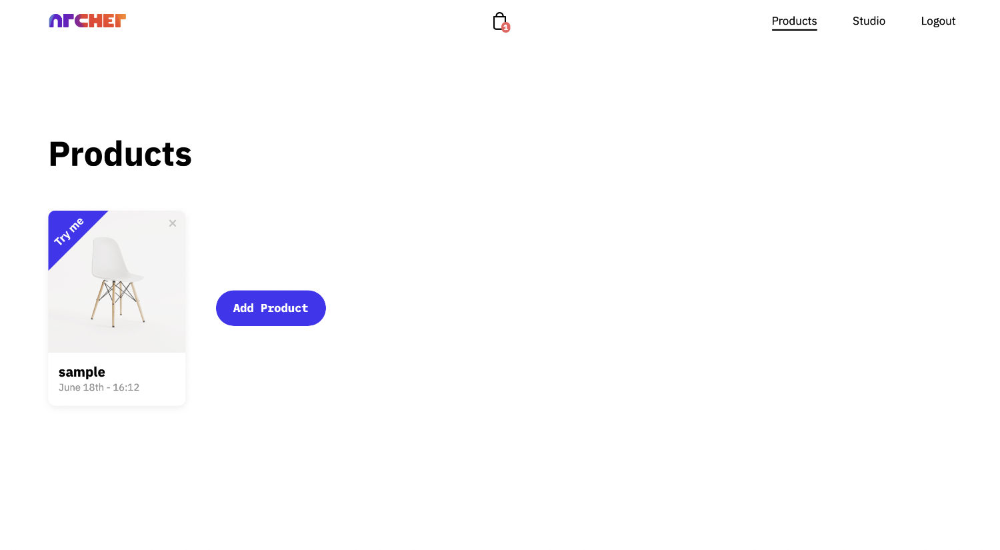
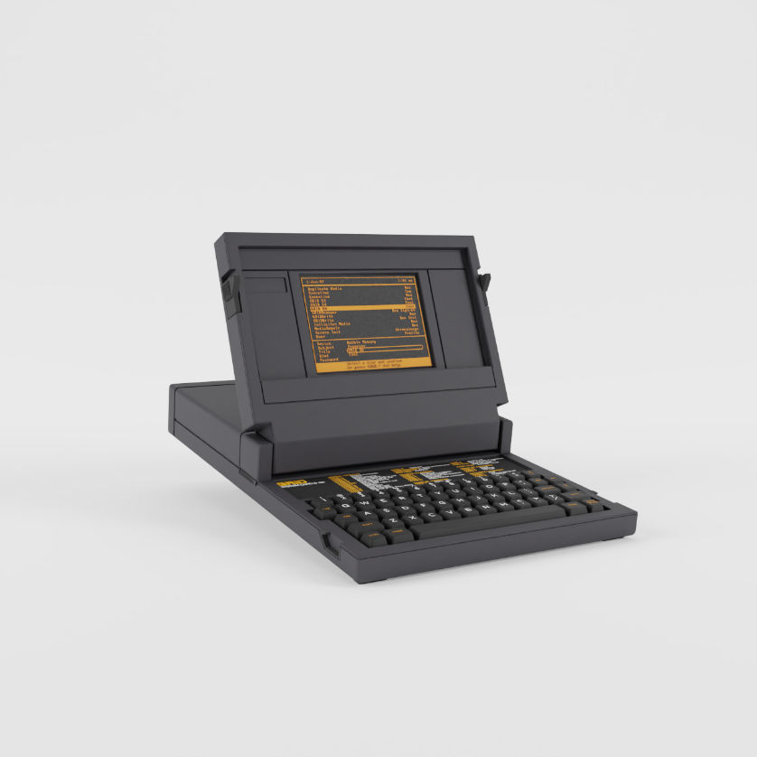
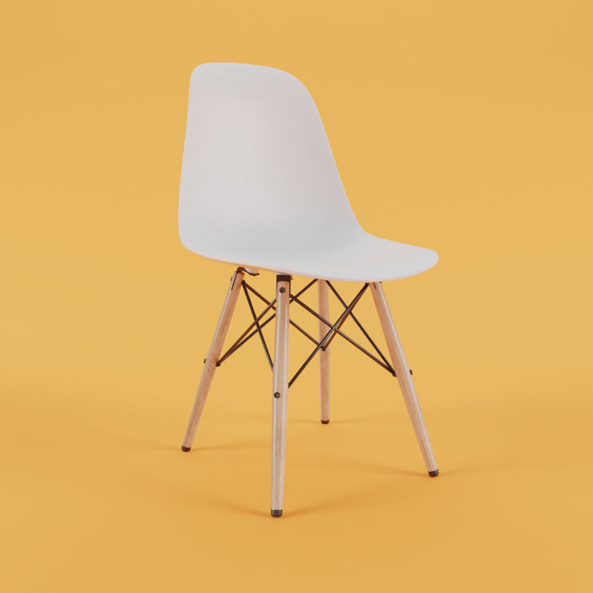
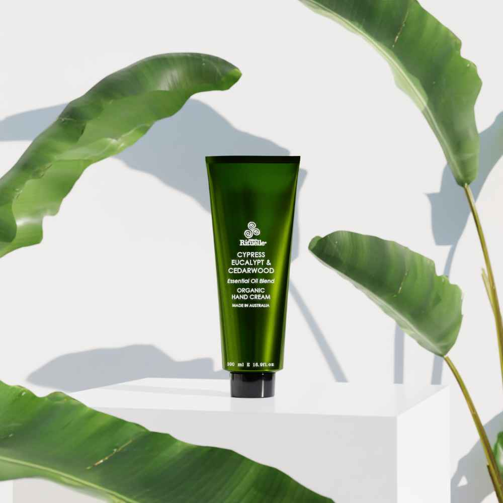
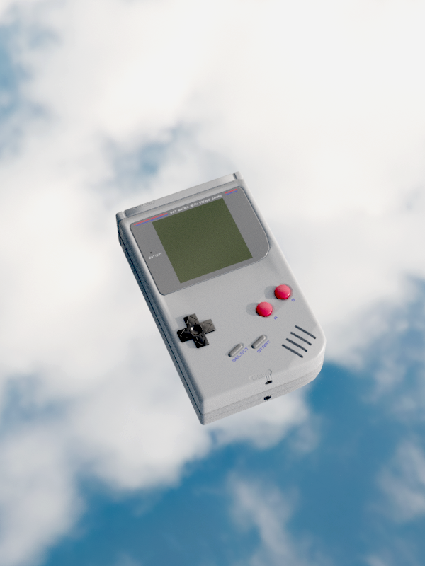

# Virtual photo studio :camera:

A CG based photo studio that runs in the browser. It enables brands to create photorealistic images from 3D models and artists to accept modelling jobs. It consists of three separate apps:

## Archer
Archer is the customer facing app and contains the virtual photo studio as well as an interface to order 3D models from snapshots of a product. 
 
[Live Demo](https://archer.fotura.co)

## Pro
A marketplace extension that allows CG artists to submit quotes for modelling jobs submitted through Archer. Jobs can be submitted through the Pro app and appear directly in customers inventories.

## Admin
A management panel to approve artists, and interact with pending jobs and quotes.
 
 
 
 
# Images

## FAQ

**Can I order images?**
 
No, this project has been discontinued. The github page exists to showcase what it once was. If you are really excited about it, feel free to contact me on github or through benner@fotura.co.
 
 
**Did the images fool people into thinking they were real photos?**
 
Yes, everyone. I still cherish the time when a photographer suggested I retouch the brown spots on the leaves in the scincare image.
